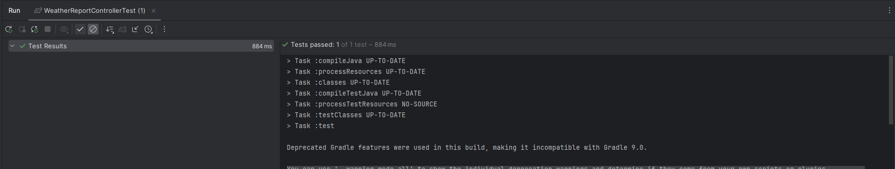

# Weather API - Spring Boot Project

## Descripción

Este proyecto es una API REST construida con Spring Boot que obtiene datos climáticos desde la API de OpenWeatherMap. La API recibe coordenadas (latitud y longitud) y proporciona detalles sobre la temperatura y la humedad.

## Prerrequisitos

Debes tener las siguientes herramientas instaladas y configuradas en tu sistema:

1. **Java 17**
2. **Gradle 8.x**

## Instalación

1. Clona el repositorio:
   ```bash
   git clone https://github.com/Richi025/weather-api-springboot.git
   ```

2. Si no tienes el **Gradle Wrapper** configurado, generarlo:
   ```bash
   gradle wrapper
   ```

3. Para construir y ejecutar la aplicación:

   Si estás en Windows:
   ```bash
   gradle bootRun
   ```


## Ejecución de pruebas

Para ejecutar las pruebas, usa el siguiente comando:

### En Windows:
```bash
gradle test
```

# Pruebas realizadas para verificar el funcionamiento de la aplicación

1. **Prueba del método `testGetWeatherReportService` en el servicio**:
   - **Descripción**: Comprueba que el servicio maneja adecuadamente las coordenadas proporcionadas y devuelve la información climática correcta.
   
   - **Resultado esperado**: La temperatura y la humedad devueltas por el servicio deben coincidir con los valores simulados por Mockito.

2. **Prueba del controlador `testGetWeatherReportController`**:
   - **Descripción**: Asegura que el controlador invoca el servicio correctamente cuando recibe una solicitud con latitud y longitud.
   
   - **Resultado esperado**: El controlador debe responder con un JSON que contenga los valores de temperatura y humedad.




## Version

Se uso [Git](https://github.com/) para el control de versiones. Para ver las versiones disponibles, consulta las etiquetas en este repositorio.

## Autor

* **Jose Ricardo Vasquez Vega** - [Richi025](https://github.com/Richi025)